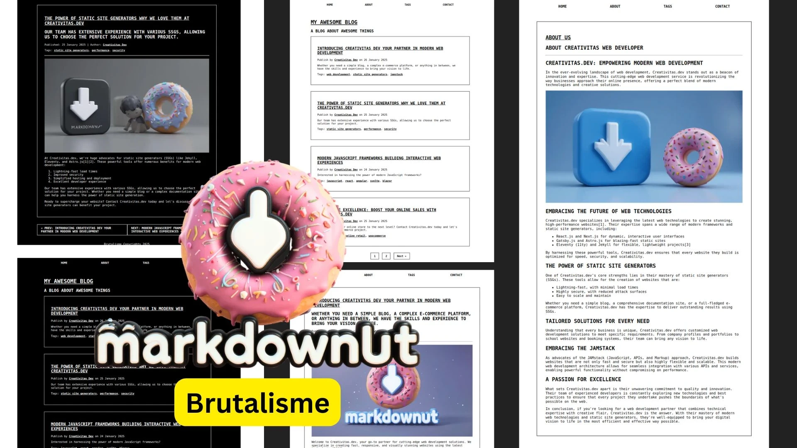
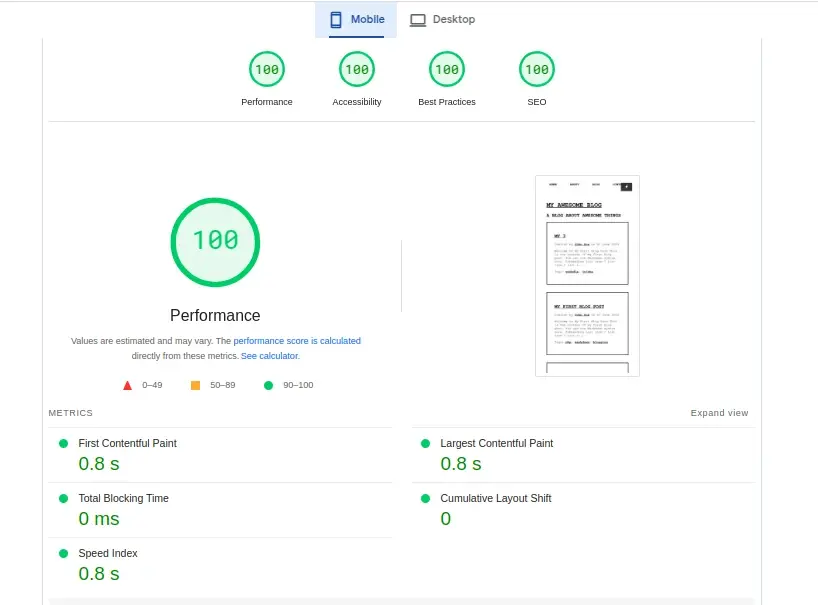
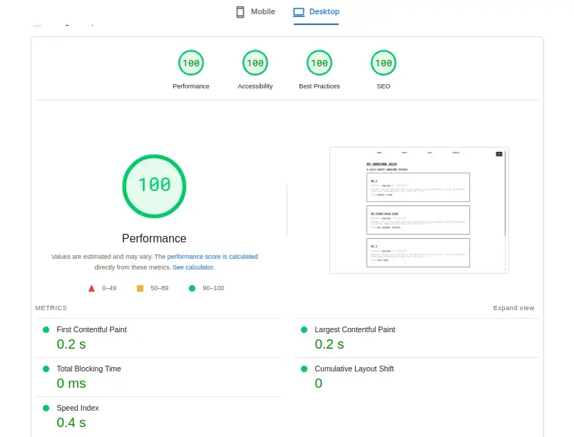

# MarkDownuts 🍩

Next Generation PHP Markdown Website - Flatifle CMS - Static Site Generator Alternative run on PHP

----

## About MarkDownuts 🍩

Do you want to develop and build a website by adopting the concept of a static site generator,working with markdown , yaml like jekyll / 11ty eleventy, and running on your PHP hosting??

MarkDownuts is the right solution for you.

This project is inspired by Jekyll, Eleventy 11ty which focuses on speed, simplicity, stability, and security. and ease of working with markdown and yaml files.

Let's start using markdownuts now to build a modern PHP website easily and quickly.

Documentation : https://markdownuts.axcora.com/

----

### Features

+ Very easy to use
+ No Database
+ No Need Build Production
+ Easy Installation , Just download and upload in to your PHP host , and your site is live
+ Can install via Composer
+ Markdown Content .md Files
+ YAML Fonrtmatter .yml files
+ Auto SEO Injection Script
+ Meta Tag
+ Twitter Card
+ Open Graph
+ Focus for Speed and Peformance
+ Run on PHP
+ Dynamic Blog Page
+ Blog List
+ Blog Pagination
+ Post Pagination
+ Tags List
+ Tags Page
+ Static Page
+ Sitemap Generator
+ Auto Sitemap (New)
+ Auto Clear Cache (New)
+ Backend CMS (On Progress...)
+ And More...

----

### [🚀 Become a Sponsor](https://github.com/sponsors/mesinkasir) | [☕ Buy me Coffee](https://www.paypal.com/cgi-bin/webscr?cmd=_s-xclick&hosted_button_id=JVZVXBC4N9DAN) |  [🍩 Buy me a Donuts](https://creativitaz.gumroad.com/coffee)

----

Test drive demo : [Run Demo](https://axcora.my.id/markdown/v2/demo/)

Download free open source code [https://www.hockeycomputindo.com/themes](https://www.hockeycomputindo.com/themes)

A Project by [Creativitas](https://creativitas.dev/)

----

### Brutalisme Starter Themes

Starter themes for help you develop your modern website quickly !!

Test Drive Brutalisme Peformance and Speed

Mobile Target

Desktop Target

----

## Get Start

Let's built and develop your modern PHP website with MarkDownuts

### Install via composer

Installation markdownuts default via composer

`composer create-project creativitas/markdownuts`

Installation markdownuts with your project name via composer

`composer create-project creativitas/markdownuts project-name`

change `project-name` with your project name, example `markdownuts`

### Install with git

Other solutions you can use terminal , open terminal and run 

`git clone https://github.com/mesinkasir/markdownuts.git`

Next step you can access your source code file, `cd yourproject`

Now we need to run installation `composer install`

Congratulations your site is live now !!

### Download Source Code

Download markDownuts complete source code file, and upload in to your host , next you can run your website, that's it !!

[Download Full Source Code Main](https://creativitaz.gumroad.com/l/markdownuts-starter)

### Setup your site

After installing and running your project, you will see the starter project is a skeleton version without CSS styling. First of course you need to set up your site, add your site URL, you can change the site name, description, social media and more into `config.yml`

After entering your site URL, via config.yml then Brutalism Starter is active as your theme.

To setup your Site for SEO , sitename, Twitter card and Open Graph ,nabar,and copyrights on footer you can update your site name , twitter user, facebook user and others on config.yml

### Create new post

If you want to create new blog post, you can access on `posts` folder, and create new markdown files.

### Create static page

If you want to create new static page, you can access on `pages` folder, and create new markdown files.

### Generate Sitemap

To generate an automatic sitemap.xml, just access `yourweb.com/getsitemp.php` change yourweb.com with your domain name.Next you check your root project folder to see the `sitemap.xml` has been created.

You can generate sitemap manually for your blog , open terminal and run `php generate_sitemap.php`

### Documentation and Official Page

You can read how work with MarkDownuts project on our documentation site - https://markdownuts.axcora.com/

----

### Next Update Backend CMS

Markdownuts currently embraces the approach of Jekyll and 11ty, seamlessly working with Markdown (.md) files and YAML configurations. This foundation provides a robust and flexible system for content management.

Looking ahead, we're excited to announce our next big step: the development of a powerful backend CMS tailored to enhance your workflow and boost productivity. This upcoming feature will offer you an intuitive interface, making content creation and management a breeze.

Stay tuned for updates as we continue to evolve Markdownuts into an even more comprehensive and user-friendly platform!

----

### [🚀 Become a Sponsor](https://github.com/sponsors/mesinkasir) | [☕ Buy me Coffee](https://www.paypal.com/cgi-bin/webscr?cmd=_s-xclick&hosted_button_id=JVZVXBC4N9DAN) |  [🍩 Buy me a Donuts](https://creativitaz.gumroad.com/coffee)

----

Test drive demo : [Run Demo](https://axcora.my.id/markdown/v2/demo/)

Download free open source code [https://www.hockeycomputindo.com/themes](https://www.hockeycomputindo.com/themes)

A Project by [Creativitas](https://creativitas.dev/)

